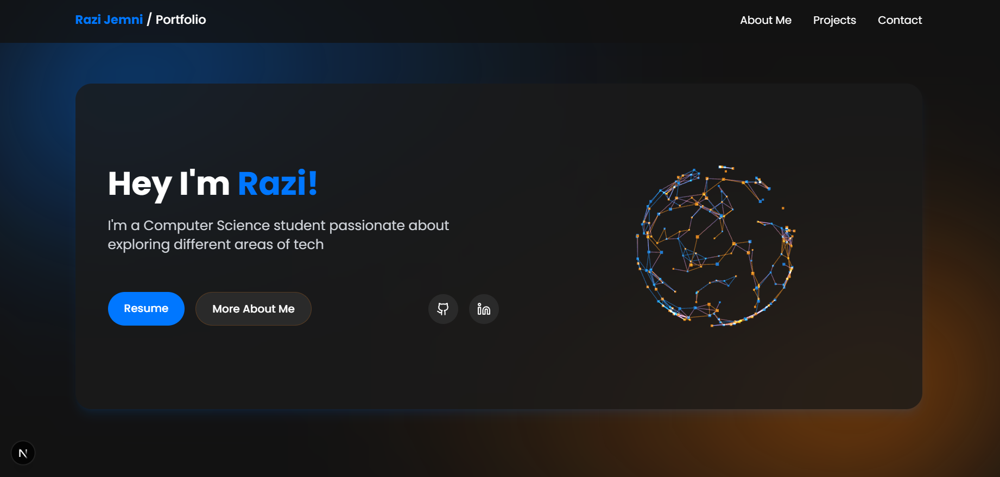

# My Portfolio

Welcome to the repository for my personal portfolio! This project showcases my skills, projects, and experience as a Computer Science student passionate about web development, mobile development, and other areas of technology.



---

## 🚀 Features

- **Modern Tech Stack**: Built with [Next.js](https://nextjs.org), [Tailwind CSS](https://tailwindcss.com), and [Three.js](https://threejs.org).
- **Interactive Design**: Includes a 3D particle sphere and responsive animations.
- **Responsive Layout**: Fully optimized for desktop and mobile devices.
- **Contact Form**: Integrated with [Formspree](https://formspree.io) for easy communication.
- **Dynamic Sections**: Projects, skills, and contact sections are dynamically rendered.

---

## 🛠️ Tech Stack

- **Frontend**: React, Next.js, TypeScript, Tailwind CSS
- **3D Graphics**: Three.js
- **Backend**: Formspree (for contact form)
- **Deployment**: Vercel

---

## 📂 Project Structure

```plaintext
my-portfolio/
├── app/                # Next.js app directory
│   ├── [layout.tsx](http://_vscodecontentref_/1)      # Root layout
│   ├── [page.tsx](http://_vscodecontentref_/2)        # Main portfolio page
│   ├── [globals.css](http://_vscodecontentref_/3)     # Global styles
├── components/         # Reusable components
│   ├── [particle-sphere.tsx](http://_vscodecontentref_/4)
│   ├── [particle-background.tsx](http://_vscodecontentref_/5)
│   └── ui/             # UI components (e.g., buttons, tooltips)
├── public/             # Static assets (images, icons)
├── styles/             # Tailwind CSS configuration
├── lib/                # Utility functions
├── hooks/              # Custom React hooks
├── [next.config.mjs](http://_vscodecontentref_/6)     # Next.js configuration
├── [tailwind.config.ts](http://_vscodecontentref_/7)  # Tailwind CSS configuration
└── [README.md](http://_vscodecontentref_/8)           # Project documentation

---

## 🌟 Getting Started

Follow these steps to set up and run the project locally:

### Prerequisites

- [Node.js](https://nodejs.org/) (v16 or later)
- [npm](https://www.npmjs.com/) or [yarn](https://yarnpkg.com/)

### Installation

1. Clone the repository:
   ```bash
   git clone https://github.com/your-username/my-portfolio.git
   cd my-portfolio
   ```

2. Install dependencies:
   ```bash
   npm install
   # or
   yarn install
   ```

### Running the Development Server

Start the development server:
```bash
npm run dev
# or
yarn dev
```

Open [http://localhost:3000](http://localhost:3000) in your browser to view the application.

### Building for Production

To create an optimized production build:
```bash
npm run build
# or
yarn build
```

Then, start the production server:
```bash
npm start
# or
yarn start
```

---

## 🤝 Contributing

Contributions are welcome! If you'd like to contribute, please follow these steps:

1. Fork the repository.
2. Create a new branch for your feature or bug fix:
   ```bash
   git checkout -b feature-name
   ```
3. Commit your changes:
   ```bash
   git commit -m "Add your message here"
   ```
4. Push to your branch:
   ```bash
   git push origin feature-name
   ```
5. Open a pull request.

---

## 📄 License

This project is licensed under the [MIT License](LICENSE). Feel free to use, modify, and distribute this project as per the license terms.
